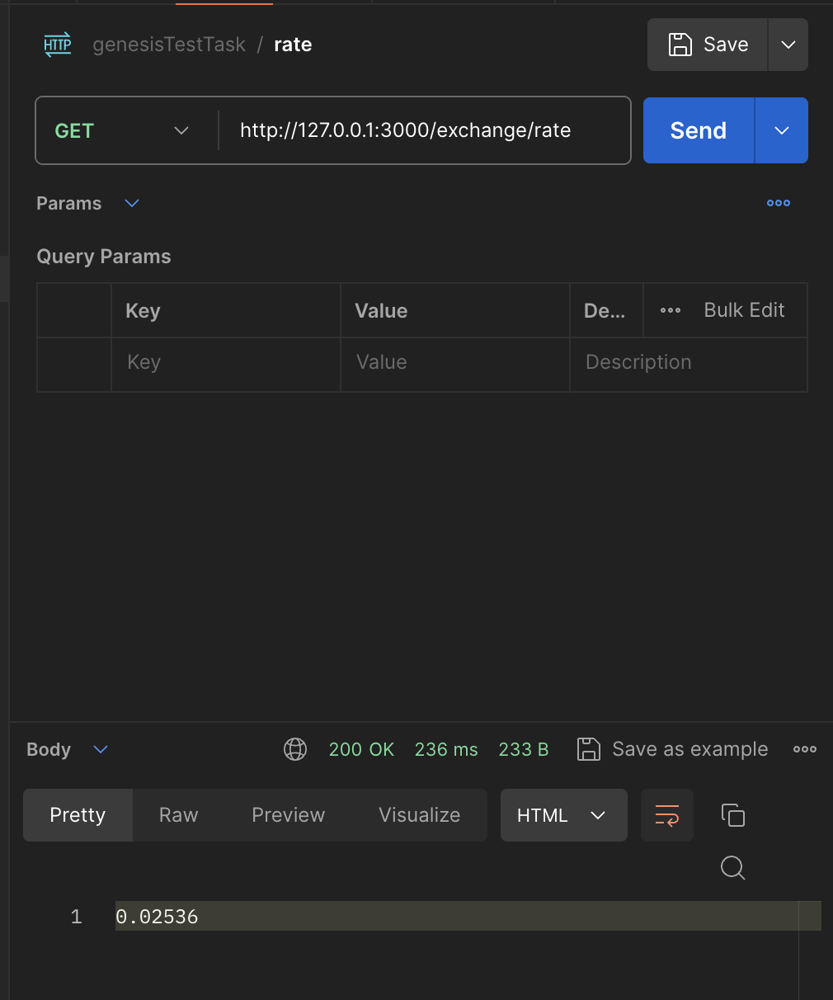

# Genesis currency rate project

### Note
for some reason when I running MySQL from docker compose I can't get access to it. Because of this I am setting up containers using bash scripts

## How to run
- Insure you are in the root of project
- Create server image by running `sh ./scripts/create-server-image.sh`
- Create mysql cotainer by running `sh ./scripts/create-mysql-container.sh`
- Create server container by running `sh ./scripts/create-server-container.sh`

After starting the server migrations will start automatically and will create required table.
That's it! Your are good to use it!

## Examples of usage
### Get the rurrent rate

### Subscribe new email

### Try to subscribe same email twice

### Subscribe different email

### Sent email manually (it gets sent automatically every day at 12:00)

### How email looks

## Examples of good setup
